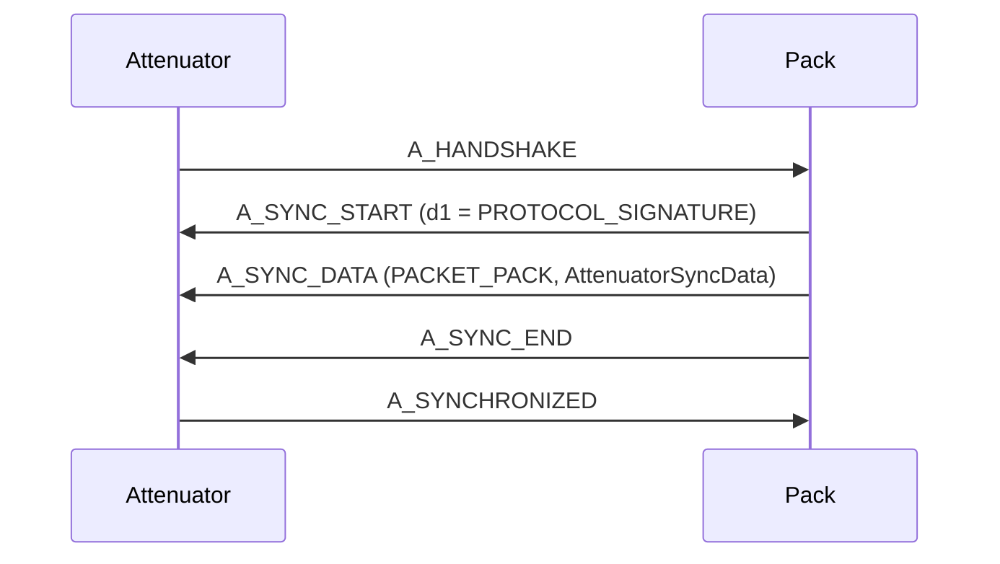
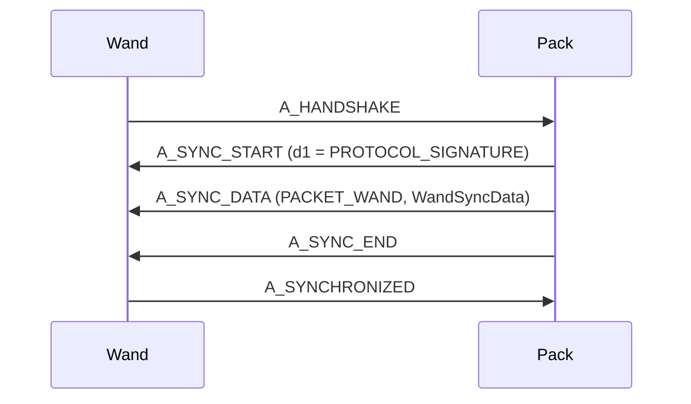
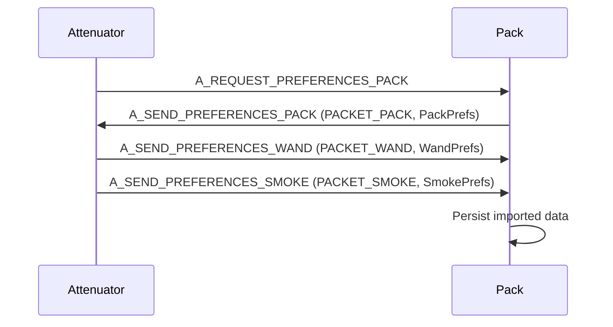
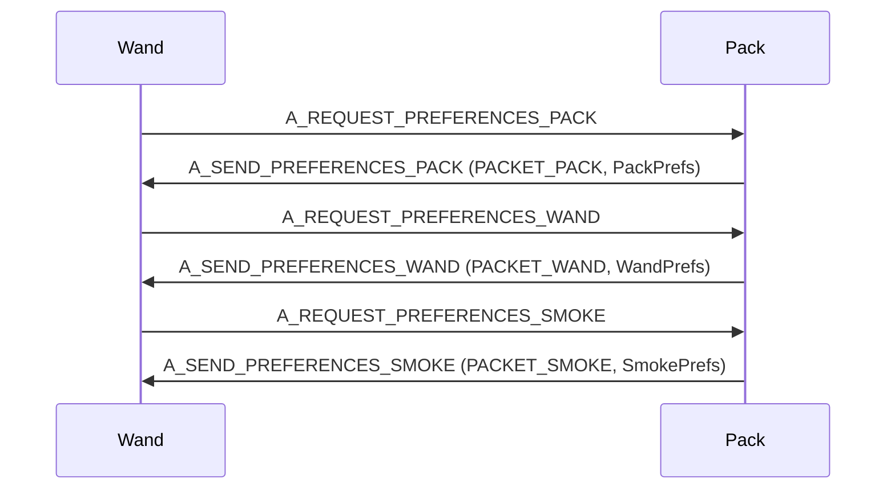
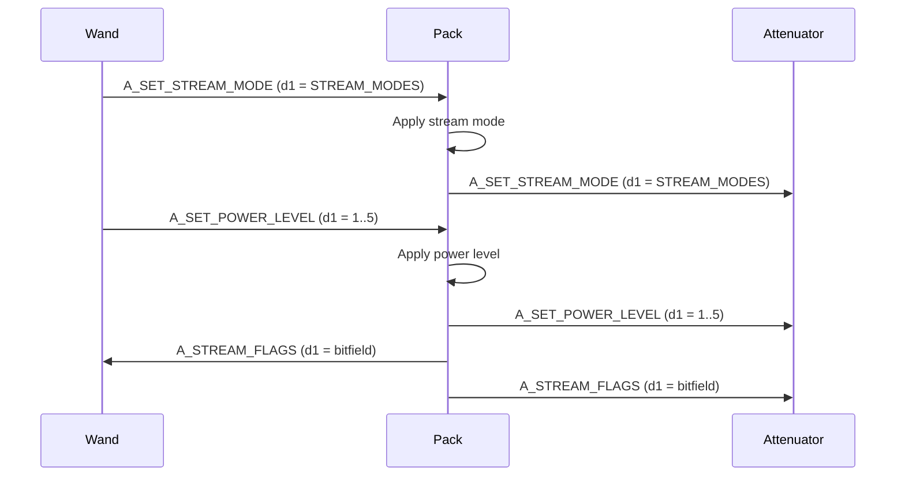
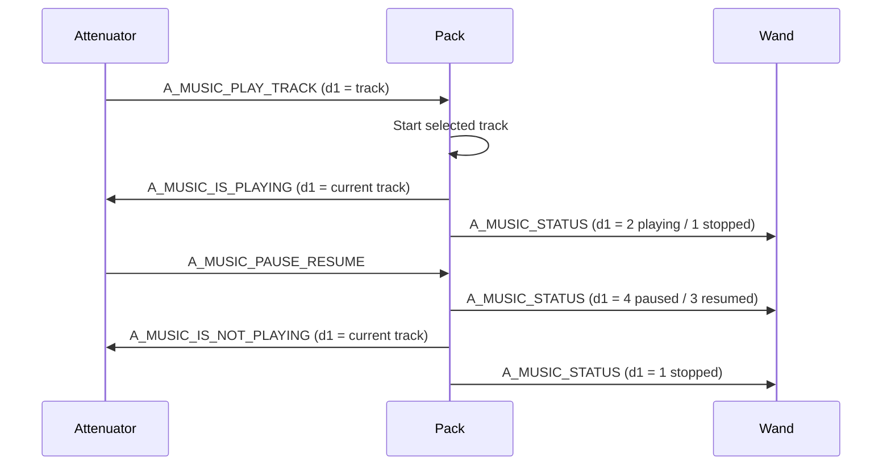
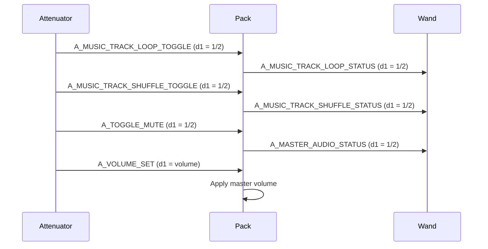
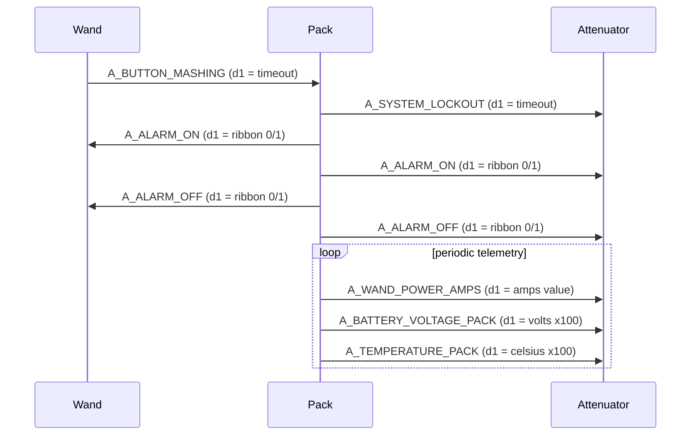

# Device API Workflows

This document captures current, code-verified discoveries from serial handlers and send wrappers.

## Alphabetical API Listing with Directional Flow

The following is an alphabetical listing of all `API_COMMAND` and `API_DATA` enums found in `Communication.h`, with observed direction(s) inferred from send wrappers in the codebase. Notably `attenuatorSerialSend()`, `packSerialSend()`, `wandSerialSend()`, and `executeCommand()`.

| API Name                                       | P --> A | A --> P | P --> W | W --> P |
| ---------------------------------------------- | ------- | ------- | ------- | ------- |
| A_HANDSHAKE                                    |         |         |         |         |
| A_SYNC_NOW                                     |         |         |         |         |
| A_SYNC_START                                   |         |         |         |         |
| A_SYNC_END                                     |         |         |         |         |
| A_SYNCHRONIZED                                 |         |         |         |         |
| A_POST_FINISH                                  |         |         |         |         |
| A_PACK_ON                                      |         |         |         |         |
| A_PACK_OFF                                     |         |         |         |         |
| A_TURN_PACK_ON                                 |         |         |         |         |
| A_TURN_PACK_OFF                                |         |         |         |         |
| A_TURN_WAND_ON                                 |         |         |         |         |
| A_WAND_CONNECTED                               |         |         |         |         |
| A_WAND_DISCONNECTED                            |         |         |         |         |
| A_WAND_ON                                      |         |         |         |         |
| A_WAND_OFF                                     |         |         |         |         |
| A_STREAM_FLAGS                                 |         |         |         |         |
| A_FIRING                                       |         |         |         |         |
| A_FIRING_STOPPED                               |         |         |         |         |
| A_FIRING_CTS                                   |         |         |         |         |
| A_FIRING_CTS_STOPPED                           |         |         |         |         |
| A_CYCLOTRON_NORMAL_SPEED                       |         |         |         |         |
| A_CYCLOTRON_INCREASE_SPEED                     |         |         |         |         |
| A_OVERHEATING                                  |         |         |         |         |
| A_OVERHEATING_FINISHED                         |         |         |         |         |
| A_VENTING                                      |         |         |         |         |
| A_VENTING_FINISHED                             |         |         |         |         |
| A_WARNING_CANCELLED                            |         |         |         |         |
| A_MANUAL_OVERHEAT                              |         |         |         |         |
| A_MANUAL_QUICK_VENT                            |         |         |         |         |
| A_BUTTON_MASHING                               |         |         |         |         |
| A_MASH_ERROR_LOOP                              |         |         |         |         |
| A_MASH_ERROR_RESTART                           |         |         |         |         |
| A_SYSTEM_LOCKOUT                               |         |         |         |         |
| A_CANCEL_LOCKOUT                               |         |         |         |         |
| A_CYCLOTRON_LID_ON                             |         |         |         |         |
| A_CYCLOTRON_LID_OFF                            |         |         |         |         |
| A_ALARM_ON                                     |         |         |         |         |
| A_ALARM_OFF                                    |         |         |         |         |
| A_MUSIC_TRACK_COUNT_SYNC                       |         |         |         |         |
| A_MUSIC_START_STOP                             |         |         |         |         |
| A_MUSIC_PAUSE_RESUME                           |         |         |         |         |
| A_MUSIC_NEXT_TRACK                             |         |         |         |         |
| A_MUSIC_PREV_TRACK                             |         |         |         |         |
| A_MUSIC_TOGGLE                                 |         |         |         |         |
| A_MUSIC_PLAY_TRACK                             |         |         |         |         |
| A_MUSIC_TRACK_LOOP_STATUS                      |         |         |         |         |
| A_MUSIC_TRACK_LOOP_TOGGLE                      |         |         |         |         |
| A_MUSIC_TRACK_SHUFFLE_STATUS                   |         |         |         |         |
| A_MUSIC_TRACK_SHUFFLE_TOGGLE                   |         |         |         |         |
| A_MUSIC_IS_PLAYING                             |         |         |         |         |
| A_MUSIC_IS_NOT_PLAYING                         |         |         |         |         |
| A_MUSIC_IS_PAUSED                              |         |         |         |         |
| A_MUSIC_IS_NOT_PAUSED                          |         |         |         |         |
| A_MUSIC_STATUS                                 |         |         |         |         |
| A_TOGGLE_MUTE                                  |         |         |         |         |
| A_VOLUME_SET                                   |         |         |         |         |
| A_VOLUME_INCREASE                              |         |         |         |         |
| A_VOLUME_DECREASE                              |         |         |         |         |
| A_VOLUME_MUSIC_INCREASE                        |         |         |         |         |
| A_VOLUME_MUSIC_DECREASE                        |         |         |         |         |
| A_VOLUME_SOUND_EFFECTS_INCREASE                |         |         |         |         |
| A_VOLUME_SOUND_EFFECTS_DECREASE                |         |         |         |         |
| A_PROTON_PACK_VOLUME_ADJUSTMENT                |         |         |         |         |
| A_NEUTRONA_WAND_VOLUME_ADJUSTMENT              |         |         |         |         |
| A_WAND_AUDIO_VERSION                           |         |         |         |         |
| A_SAVE_EEPROM_SETTINGS_PACK                    |         |         |         |         |
| A_SAVE_EEPROM_SETTINGS_WAND                    |         |         |         |         |
| A_RESET_EEPROM_SETTINGS_PACK                   |         |         |         |         |
| A_RESET_EEPROM_SETTINGS_WAND                   |         |         |         |         |
| A_CLEAR_LED_EEPROM_SETTINGS                    |         |         |         |         |
| A_SAVE_LED_EEPROM_SETTINGS                     |         |         |         |         |
| A_VOLUME_INCREASE_EEPROM                       |         |         |         |         |
| A_VOLUME_DECREASE_EEPROM                       |         |         |         |         |
| A_CLEAR_CONFIG_EEPROM_SETTINGS                 |         |         |         |         |
| A_EEPROM_CONFIG_MENU                           |         |         |         |         |
| A_EEPROM_LED_MENU                              |         |         |         |         |
| A_RESET_EEPROM_WAND                            |         |         |         |         |
| A_SAVE_CONFIG_EEPROM_SETTINGS                  |         |         |         |         |
| A_SAVE_EEPROM_WAND                             |         |         |         |         |
| A_MODE_1984                                    |         |         |         |         |
| A_MODE_1989                                    |         |         |         |         |
| A_MODE_AFTERLIFE                               |         |         |         |         |
| A_MODE_FROZEN_EMPIRE                           |         |         |         |         |
| A_YEAR_1984                                    |         |         |         |         |
| A_YEAR_1989                                    |         |         |         |         |
| A_YEAR_AFTERLIFE                               |         |         |         |         |
| A_YEAR_FROZEN_EMPIRE                           |         |         |         |         |
| A_YEAR_MODES_CYCLE                             |         |         |         |         |
| A_YEAR_MODES_CYCLE_EEPROM                      |         |         |         |         |
| A_BARGRAPH_28_SEGMENTS                         |         |         |         |         |
| A_BARGRAPH_30_SEGMENTS                         |         |         |         |         |
| A_BARREL_EXTENDED                              |         |         |         |         |
| A_BARREL_RETRACTED                             |         |         |         |         |
| A_BATTERY_VOLTAGE_PACK                         |         |         |         |         |
| A_CROSS_THE_STREAMS                            |         |         |         |         |
| A_CROSS_THE_STREAMS_MIX                        |         |         |         |         |
| A_CTS_1984                                     |         |         |         |         |
| A_CTS_AFTERLIFE                                |         |         |         |         |
| A_CTS_DEFAULT                                  |         |         |         |         |
| A_CYCLOTRON_CLOCKWISE                          |         |         |         |         |
| A_CYCLOTRON_COUNTER_CLOCKWISE                  |         |         |         |         |
| A_CYCLOTRON_DIMMING                            |         |         |         |         |
| A_CYCLOTRON_DIRECTION_TOGGLE                   |         |         |         |         |
| A_CYCLOTRON_LED_TOGGLE                         |         |         |         |         |
| A_CYCLOTRON_PANEL_DIMMING                      |         |         |         |         |
| A_CYCLOTRON_SIMULATE_RING_TOGGLE               |         |         |         |         |
| A_CYCLOTRON_SINGLE_LED                         |         |         |         |         |
| A_CYCLOTRON_THREE_LED                          |         |         |         |         |
| A_DEFAULT_BARGRAPH                             |         |         |         |         |
| A_DEFAULT_FIRING_ANIMATIONS_BARGRAPH           |         |         |         |         |
| A_DIMMING                                      |         |         |         |         |
| A_DIMMING_DECREASE                             |         |         |         |         |
| A_DIMMING_INCREASE                             |         |         |         |         |
| A_DIMMING_TOGGLE                               |         |         |         |         |
| A_FIRING_ALT_MIX                               |         |         |         |         |
| A_FIRING_ALT_STOPPED_MIX                       |         |         |         |         |
| A_FIRING_CROSSING_THE_STREAMS_1984             |         |         |         |         |
| A_FIRING_CROSSING_THE_STREAMS_2021             |         |         |         |         |
| A_FIRING_CROSSING_THE_STREAMS_MIX_1984         |         |         |         |         |
| A_FIRING_CROSSING_THE_STREAMS_MIX_2021         |         |         |         |         |
| A_FIRING_CROSSING_THE_STREAMS_STOPPED_MIX_1984 |         |         |         |         |
| A_FIRING_CROSSING_THE_STREAMS_STOPPED_MIX_2021 |         |         |         |         |
| A_FIRING_INTENSIFY_MIX                         |         |         |         |         |
| A_FIRING_INTENSIFY_STOPPED_MIX                 |         |         |         |         |
| A_GB1_WAND_BARREL_EXTEND                       |         |         |         |         |
| A_GRB_INNER_CYCLOTRON_LEDS                     |         |         |         |         |
| A_INNER_CYCLOTRON_DIMMING                      |         |         |         |         |
| A_INNER_CYCLOTRON_PANEL_DISABLED               |         |         |         |         |
| A_INNER_CYCLOTRON_PANEL_DYNAMIC                |         |         |         |         |
| A_INNER_CYCLOTRON_PANEL_STATIC                 |         |         |         |         |
| A_ION_ARM_SWITCH_ON                            |         |         |         |         |
| A_ION_ARM_SWITCH_OFF                           |         |         |         |         |
| A_MASTER_AUDIO_STATUS                          |         |         |         |         |
| A_MESON_FIRE_PULSE                             |         |         |         |         |
| A_MODE_ORIGINAL                                |         |         |         |         |
| A_MODE_ORIGINAL_BARGRAPH                       |         |         |         |         |
| A_MODE_ORIGINAL_FIRING_ANIMATIONS_BARGRAPH     |         |         |         |         |
| A_MODE_ORIGINAL_HEATDOWN                       |         |         |         |         |
| A_MODE_ORIGINAL_HEATDOWN_STOP                  |         |         |         |         |
| A_MODE_ORIGINAL_HEATUP                         |         |         |         |         |
| A_MODE_ORIGINAL_HEATUP_STOP                    |         |         |         |         |
| A_MODE_SUPER_HERO                              |         |         |         |         |
| A_MODE_SUPER_HERO_BARGRAPH                     |         |         |         |         |
| A_MODE_SUPER_HERO_FIRING_ANIMATIONS_BARGRAPH   |         |         |         |         |
| A_MODE_TOGGLE                                  |         |         |         |         |
| A_NEUTRONA_WAND_1984_MODE                      |         |         |         |         |
| A_NEUTRONA_WAND_1989_MODE                      |         |         |         |         |
| A_NEUTRONA_WAND_AFTERLIFE_MODE                 |         |         |         |         |
| A_NEUTRONA_WAND_DEFAULT_MODE                   |         |         |         |         |
| A_NEUTRONA_WAND_FROZEN_EMPIRE_MODE             |         |         |         |         |
| A_OVERHEAT_DECREASE_LEVEL_1                    |         |         |         |         |
| A_OVERHEAT_DECREASE_LEVEL_2                    |         |         |         |         |
| A_OVERHEAT_DECREASE_LEVEL_3                    |         |         |         |         |
| A_OVERHEAT_DECREASE_LEVEL_4                    |         |         |         |         |
| A_OVERHEAT_DECREASE_LEVEL_5                    |         |         |         |         |
| A_OVERHEAT_INCREASE_LEVEL_1                    |         |         |         |         |
| A_OVERHEAT_INCREASE_LEVEL_2                    |         |         |         |         |
| A_OVERHEAT_INCREASE_LEVEL_3                    |         |         |         |         |
| A_OVERHEAT_INCREASE_LEVEL_4                    |         |         |         |         |
| A_OVERHEAT_INCREASE_LEVEL_5                    |         |         |         |         |
| A_PACK_MOTORIZED_CYCLOTRON_ENABLED             |         |         |         |         |
| A_POWERCELL_DIMMING                            |         |         |         |         |
| A_RGB_INNER_CYCLOTRON_LEDS                     |         |         |         |         |
| A_SMOKE_TOGGLE                                 |         |         |         |         |
| A_SPECTRAL_CYCLOTRON_CUSTOM_DECREASE           |         |         |         |         |
| A_SPECTRAL_CYCLOTRON_CUSTOM_INCREASE           |         |         |         |         |
| A_SPECTRAL_INNER_CYCLOTRON_CUSTOM_DECREASE     |         |         |         |         |
| A_SPECTRAL_INNER_CYCLOTRON_CUSTOM_INCREASE     |         |         |         |         |
| A_SPECTRAL_POWERCELL_CUSTOM_DECREASE           |         |         |         |         |
| A_SPECTRAL_POWERCELL_CUSTOM_INCREASE           |         |         |         |         |
| A_SUPER_HERO_BARGRAPH                          |         |         |         |         |
| A_SUPER_HERO_FIRING_ANIMATIONS_BARGRAPH        |         |         |         |         |
| A_TEMPERATURE_PACK                             |         |         |         |         |
| A_TOGGLE_CYCLOTRON_LEDS                        |         |         |         |         |
| A_TOGGLE_INNER_CYCLOTRON_LEDS                  |         |         |         |         |
| A_TOGGLE_INNER_CYCLOTRON_PANEL                 |         |         |         |         |
| A_TOGGLE_POWERCELL_DIRECTION                   |         |         |         |         |
| A_TOGGLE_POWERCELL_LEDS                        |         |         |         |         |
| A_TOGGLE_RGB_INNER_CYCLOTRON_LEDS              |         |         |         |         |
| A_TOGGLE_SMOKE                                 |         |         |         |         |
| A_TOGGLE_VIBRATION                             |         |         |         |         |
| A_VIDEO_GAME_MODE                              |         |         |         |         |
| A_VIDEO_GAME_MODE_COLOUR_TOGGLE                |         |         |         |         |
| A_VIDEO_GAME_MODE_CYCLOTRON_ENABLED            |         |         |         |         |
| A_VIDEO_GAME_MODE_POWER_CELL_ENABLED           |         |         |         |         |
| A_WAND_BARREL_RETRACT                          |         |         |         |         |
| A_WAND_BEEP_BARGRAPH                           |         |         |         |         |
| A_WAND_BOOTUP_1989                             |         |         |         |         |
| A_WAND_POWER_AMPS                              |         |         |         |         |
| A_YEAR_MODE_DEFAULT                            |         |         |         |         |
| A_RESET_WIFI_PASSWORD                          |         |         |         |         |
| A_TOGGLE_PACK_WIFI                             |         |         |         |         |
| A_WAND_WIFI_RESET                              |         |         |         |         |
| A_REQUEST_PREFERENCES_PACK                     |         |         |         |         |
| A_REQUEST_PREFERENCES_WAND                     |         |         |         |         |
| A_REQUEST_PREFERENCES_SMOKE                    |         |         |         |         |
| A_SEND_PREFERENCES_PACK                        |         |         |         |         |
| A_SEND_PREFERENCES_WAND                        |         |         |         |         |
| A_SEND_PREFERENCES_SMOKE                       |         |         |         |         |
| A_SAVE_PREFERENCES_PACK                        |         |         |         |         |
| A_SAVE_PREFERENCES_WAND                        |         |         |         |         |
| A_SAVE_PREFERENCES_SMOKE                       |         |         |         |         |
| A_BEEPS_ALT                                    |         |         |         |         |
| A_BEEP_START                                   |         |         |         |         |
| A_BOSON_DART_SOUND                             |         |         |         |         |
| A_MESON_COLLIDER_SOUND                         |         |         |         |         |
| A_SHOCK_BLAST_SOUND                            |         |         |         |         |
| A_SLIME_TETHER_SOUND                           |         |         |         |         |
| A_WAND_BOOTUP_SHORT_SOUND                      |         |         |         |         |
| A_WAND_BOOTUP_SOUND                            |         |         |         |         |
| A_WAND_MASH_ERROR_SOUND                        |         |         |         |         |
| A_WAND_SHUTDOWN_SOUND                          |         |         |         |         |
| A_AFTERLIFE_GUN_LOOP_1                         |         |         |         |         |
| A_AFTERLIFE_GUN_LOOP_2                         |         |         |         |         |
| A_AFTERLIFE_GUN_RAMP_1                         |         |         |         |         |
| A_AFTERLIFE_GUN_RAMP_2                         |         |         |         |         |
| A_AFTERLIFE_GUN_RAMP_2_FADE_IN                 |         |         |         |         |
| A_AFTERLIFE_GUN_RAMP_DOWN_1                    |         |         |         |         |
| A_AFTERLIFE_GUN_RAMP_DOWN_2                    |         |         |         |         |
| A_AFTERLIFE_GUN_RAMP_DOWN_2_FADE_OUT           |         |         |         |         |
| A_AFTERLIFE_RAMP_LOOP_2_STOP                   |         |         |         |         |
| A_AFTERLIFE_WAND_BARREL_EXTEND                 |         |         |         |         |
| A_BARREL_ERROR_SOUND                           |         |         |         |         |
| A_EXTRA_WAND_SOUNDS_STOP                       |         |         |         |         |
| A_IMPACT_SOUND                                 |         |         |         |         |
| A_COM_SOUND_NUMBER                             |         |         |         |         |
| A_REQUEST_BEEP_SYNC                            |         |         |         |         |
| A_SOUND_DEFAULT_SYSTEM_VOLUME_ADJUSTMENT       |         |         |         |         |
| A_SOUND_SUPER_HERO                             |         |         |         |         |
| A_SOUND_MODE_ORIGINAL                          |         |         |         |         |
| A_SOUND_OVERHEAT_SMOKE_DURATION                |         |         |         |         |
| A_SOUND_OVERHEAT_START_TIMER                   |         |         |         |         |
| A_WAND_BEEP                                    |         |         |         |         |
| A_WAND_BEEP_START                              |         |         |         |         |
| A_WAND_BEEP_STOP                               |         |         |         |         |
| A_WAND_BEEP_STOP_LOOP                          |         |         |         |         |
| A_WAND_BEEP_SOUNDS                             |         |         |         |         |
| A_SAY_MENU_LEVEL                               |         |         |         |         |
| A_SET_AUTO_VENT_INTENSITY                      |         |         |         |         |
| A_SET_BARGRAPH_INVERT                          |         |         |         |         |
| A_SET_BARGRAPH_OVERHEAT_BLINK                  |         |         |         |         |
| A_SET_BARREL_SWITCH                            |         |         |         |         |
| A_SET_BARREL_TYPE                              |         |         |         |         |
| A_SET_BOOTUP_ERRORS                            |         |         |         |         |
| A_SET_CONTINUOUS_SMOKE_1                       |         |         |         |         |
| A_SET_CONTINUOUS_SMOKE_2                       |         |         |         |         |
| A_SET_CONTINUOUS_SMOKE_3                       |         |         |         |         |
| A_SET_CONTINUOUS_SMOKE_4                       |         |         |         |         |
| A_SET_CONTINUOUS_SMOKE_5                       |         |         |         |         |
| A_SET_CYCLOTRON_FADING                         |         |         |         |         |
| A_SET_CYCLOTRON_LED_COUNT                      |         |         |         |         |
| A_SET_CYCLOTRON_SIMULATE_RING                  |         |         |         |         |
| A_SET_DEMO_LIGHT_MODE                          |         |         |         |         |
| A_SET_FIRING_MODE                              |         |         |         |         |
| A_SET_INNER_CYCLOTRON_LED_COUNT                |         |         |         |         |
| A_SET_MODE_BEEP_LOOP                           |         |         |         |         |
| A_SET_OVERHEAT_LEVEL_1                         |         |         |         |         |
| A_SET_OVERHEAT_LEVEL_2                         |         |         |         |         |
| A_SET_OVERHEAT_LEVEL_3                         |         |         |         |         |
| A_SET_OVERHEAT_LEVEL_4                         |         |         |         |         |
| A_SET_OVERHEAT_LEVEL_5                         |         |         |         |         |
| A_SET_OVERHEAT_LIGHTS_OFF                      |         |         |         |         |
| A_SET_OVERHEAT_STROBE                          |         |         |         |         |
| A_SET_OVERHEAT_SYNC_FAN                        |         |         |         |         |
| A_SET_OVERHEATING                              |         |         |         |         |
| A_SET_PACK_GPSTAR_AUDIO_LED                    |         |         |         |         |
| A_SET_PACK_VIBRATION_MODE                      |         |         |         |         |
| A_SET_POWER_LEVEL                              |         |         |         |         |
| A_SET_POWERCELL_INVERT                         |         |         |         |         |
| A_SET_POWERCELL_LED_COUNT                      |         |         |         |         |
| A_SET_PROTON_STREAM_IMPACT                     |         |         |         |         |
| A_SET_QUICK_BOOTUP                             |         |         |         |         |
| A_SET_QUICK_VENT                               |         |         |         |         |
| A_SET_RGB_VENT                                 |         |         |         |         |
| A_SET_SMOKE                                    |         |         |         |         |
| A_SET_SPECTRAL_LIGHTS                          |         |         |         |         |
| A_SET_SPECTRAL_MODES                           |         |         |         |         |
| A_SET_STREAM_MODE                              |         |         |         |         |
| A_SET_VENT_LIGHT_COLOURS                       |         |         |         |         |
| A_SET_VIDEO_GAME_MODE_COLOURS                  |         |         |         |         |
| A_SET_VIBRATION_MODE                           |         |         |         |         |
| A_SET_VOICE_NEUTRONA_WAND_SOUNDS               |         |         |         |         |
| A_SET_WAND_GPSTAR_AUDIO_LED                    |         |         |         |         |
| A_SET_WAND_VIBRATION_MODE                      |         |         |         |         |
| A_SET_WAND_WIFI                                |         |         |         |         |
| A_SYNC_DATA                                    |         |         |         |         |
| A_VOLUME_SYNC                                  |         |         |         |         |
| A_SPECTRAL_COLOUR_DATA                         |         |         |         |         |

---

## Special API Sequences

### 1) Handshake + Sync: Attenuator <-> Pack

---

### 2) Handshake + Sync: Wand <-> Pack

---

### 3) Preferences Exchange: Attenuator <-> Pack

---

### 4) Preferences Exchange: Wand <-> Pack

---

### 5) Stream Mode + Power Propagation

---

### 6) Music Control + Playback Status Propagation

---

### 7) Loop/Shuffle/Mute + Volume Control Propagation

---

### 8) Alarm + Lockout + Telemetry Status Flows

