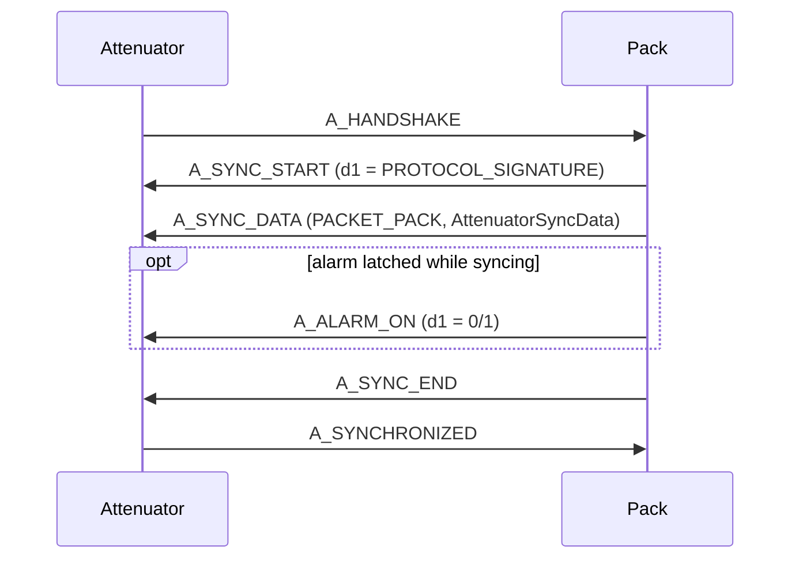
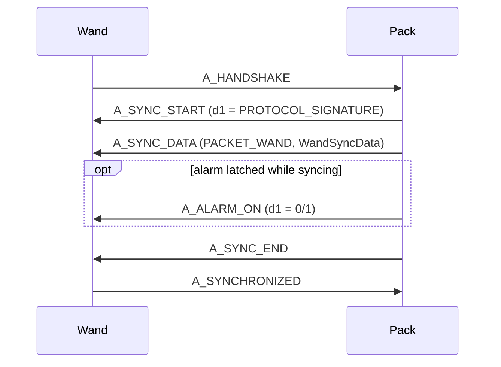
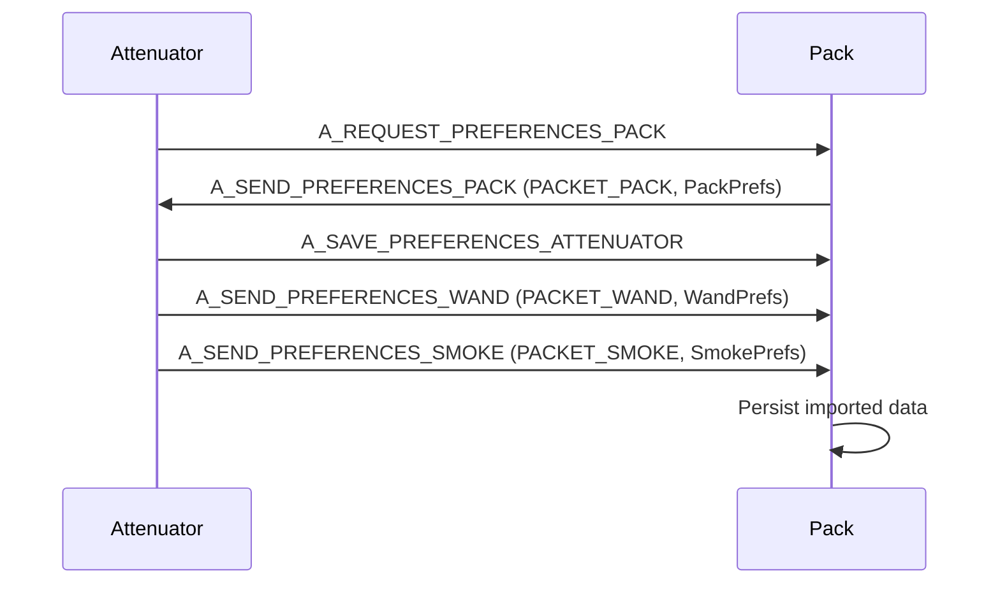
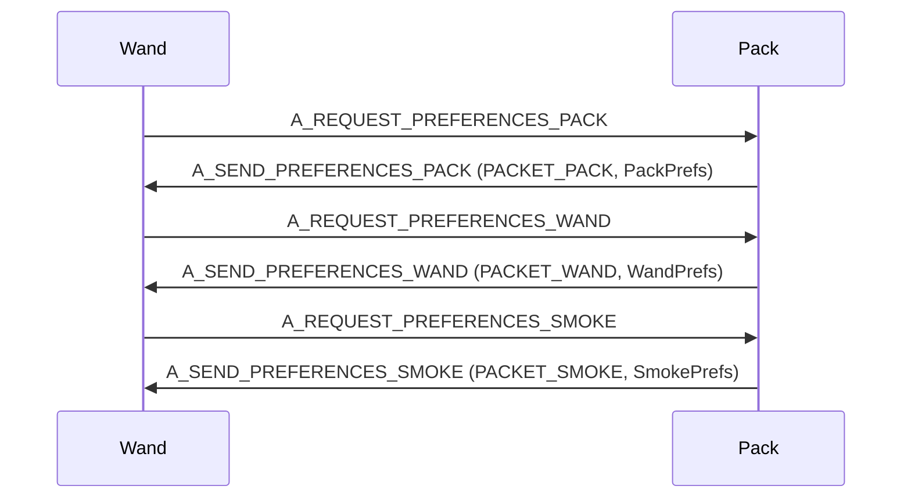
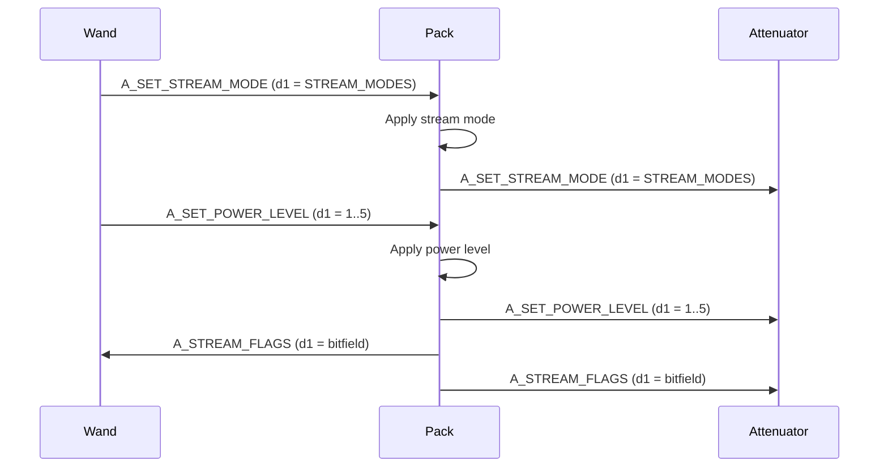
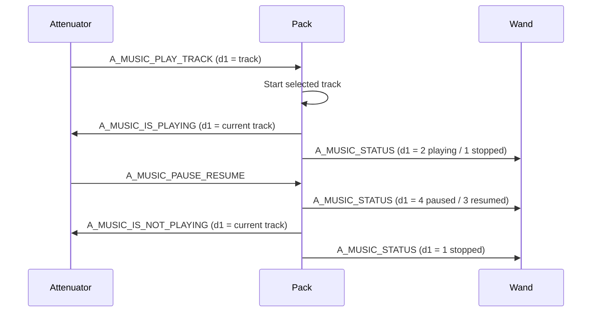
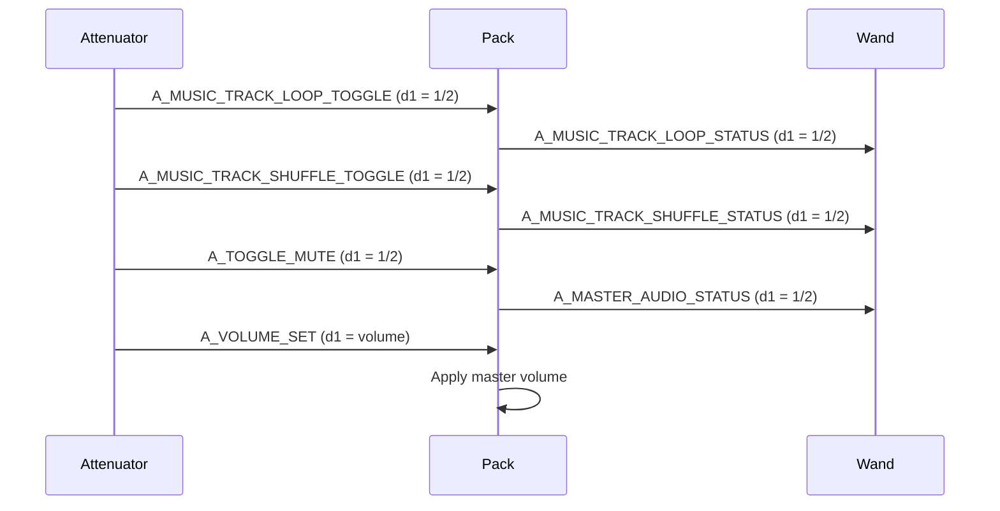
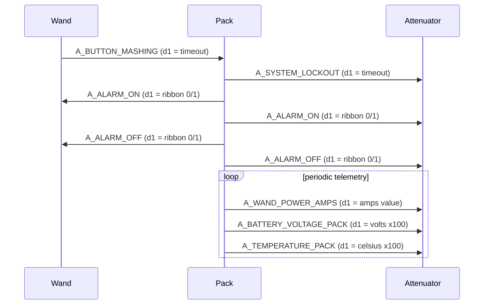

# Device API Workflows

This document captures current, code-verified discoveries from serial handlers and send wrappers.

Scope of devices and directionally-specific APIs currently documented:

- `Pack -> Attenuator`
- `Attenuator -> Pack`
- `Pack -> Wand`
- `Wand -> Pack`

---

## 1) Handshake + Sync: Pack <-> Attenuator

### APIs observed in this sequence

- `A_HANDSHAKE` (command)
  - Direction: `Attenuator -> Pack`
- `A_SYNC_START` (command)
  - Direction: `Pack -> Attenuator`
  - d1: protocol signature selector/hash value
- `A_SYNC_DATA` (data packet)
  - Direction: `Pack -> Attenuator`
  - packetType: `PACKET_PACK`
  - payload: `AttenuatorSyncData`
- `A_ALARM_ON` (command, optional during sync)
  - Direction: `Pack -> Attenuator`
  - d1: ribbon state (`0`/`1`)
- `A_SYNC_END` (command)
  - Direction: `Pack -> Attenuator`
- `A_SYNCHRONIZED` (command)
  - Direction: `Attenuator -> Pack`

---

## 2) Handshake + Sync: Pack <-> Wand

### APIs observed in this sequence

- `A_HANDSHAKE` (command)
  - Direction: `Wand -> Pack`
- `A_SYNC_START` (command)
  - Direction: `Pack -> Wand`
  - d1: protocol signature selector/hash value
- `A_SYNC_DATA` (data packet)
  - Direction: `Pack -> Wand`
  - packetType: `PACKET_WAND`
  - payload: `WandSyncData`
- `A_ALARM_ON` (command, optional during sync)
  - Direction: `Pack -> Wand`
  - d1: ribbon state (`0`/`1`)
- `A_SYNC_END` (command)
  - Direction: `Pack -> Wand`
- `A_SYNCHRONIZED` (command)
  - Direction: `Wand -> Pack`

---

## 3) Preferences Exchange: Pack <-> Attenuator

### APIs observed in this sequence

- `A_REQUEST_PREFERENCES_PACK` (command)
  - Direction: `Attenuator -> Pack`
- `A_SEND_PREFERENCES_PACK` (data packet)
  - Direction: `Pack -> Attenuator`
  - packetType: `PACKET_PACK`
  - payload: `PackPrefs`
- `A_SAVE_PREFERENCES_ATTENUATOR` (command)
  - Direction: `Attenuator -> Pack`
- `A_SEND_PREFERENCES_WAND` (data packet)
  - Direction: `Attenuator -> Pack`
  - packetType: `PACKET_WAND`
  - payload: `WandPrefs`
- `A_SEND_PREFERENCES_SMOKE` (data packet)
  - Direction: `Attenuator -> Pack`
  - packetType: `PACKET_SMOKE`
  - payload: `SmokePrefs`

---

## 4) Preferences Exchange: Pack <-> Wand

### APIs observed in this sequence

- `A_REQUEST_PREFERENCES_PACK` (command)
  - Direction: `Wand -> Pack`
- `A_SEND_PREFERENCES_PACK` (data packet)
  - Direction: `Pack -> Wand`
  - packetType: `PACKET_PACK`
  - payload: `PackPrefs`
- `A_REQUEST_PREFERENCES_WAND` (command)
  - Direction: `Wand -> Pack`
- `A_SEND_PREFERENCES_WAND` (data packet)
  - Direction: `Pack -> Wand`
  - packetType: `PACKET_WAND`
  - payload: `WandPrefs`
- `A_REQUEST_PREFERENCES_SMOKE` (command)
  - Direction: `Wand -> Pack`
- `A_SEND_PREFERENCES_SMOKE` (data packet)
  - Direction: `Pack -> Wand`
  - packetType: `PACKET_SMOKE`
  - payload: `SmokePrefs`

---

## 5) Stream Mode + Power Propagation

### APIs observed in this sequence

- `A_SET_STREAM_MODE` (command)
  - Direction: `Wand -> Pack`, then `Pack -> Attenuator`
  - d1: `STREAM_MODES` enum value
- `A_SET_POWER_LEVEL` (command)
  - Direction: `Wand -> Pack`, then `Pack -> Attenuator`
  - d1: power level (`1..5`)
- `A_STREAM_FLAGS` (command)
  - Direction: `Pack -> Wand` and `Pack -> Attenuator`
  - d1: stream state bitfield flags

---

## 6) Music Control + Playback Status Propagation

### APIs observed in this sequence

- `A_MUSIC_PLAY_TRACK` (command)
  - Direction: `Attenuator -> Pack`
  - d1: track number to play
- `A_MUSIC_IS_PLAYING` (command)
  - Direction: `Pack -> Attenuator`
  - d1: current track number
- `A_MUSIC_IS_NOT_PLAYING` (command)
  - Direction: `Pack -> Attenuator`
  - d1: current track number
- `A_MUSIC_STATUS` (command)
  - Direction: `Pack -> Wand`
  - d1: playback state (`1` stopped, `2` playing, `3` resumed, `4` paused)

---

## 7) Loop/Shuffle/Mute + Volume Control Propagation

### APIs observed in this sequence

- `A_MUSIC_TRACK_LOOP_TOGGLE` (command)
  - Direction: `Attenuator -> Pack`
  - d1: toggle request (`1` OFF, `2` ON)
- `A_MUSIC_TRACK_LOOP_STATUS` (command)
  - Direction: `Pack -> Wand`
  - d1: loop status (`1` OFF, `2` ON)
- `A_MUSIC_TRACK_SHUFFLE_TOGGLE` (command)
  - Direction: `Attenuator -> Pack`
  - d1: toggle request (`1` OFF, `2` ON)
- `A_MUSIC_TRACK_SHUFFLE_STATUS` (command)
  - Direction: `Pack -> Wand`
  - d1: shuffle status (`1` OFF, `2` ON)
- `A_TOGGLE_MUTE` (command)
  - Direction: `Attenuator -> Pack`
  - d1: mute toggle request (`1` OFF, `2` ON)
- `A_MASTER_AUDIO_STATUS` (command)
  - Direction: `Pack -> Wand`
  - d1: master audio mute status (`1` OFF, `2` ON)
- `A_VOLUME_SET` (command)
  - Direction: `Attenuator -> Pack`
  - d1: volume value (`0..255`)

---

## 8) Alarm + Lockout + Telemetry Status Flows

### APIs observed in this sequence

- `A_BUTTON_MASHING` (command)
  - Direction: `Wand -> Pack`
  - d1: timeout value
- `A_SYSTEM_LOCKOUT` (command)
  - Direction: `Pack -> Attenuator`
  - d1: timeout value
- `A_ALARM_ON` / `A_ALARM_OFF` (command)
  - Direction: `Pack -> Wand` and `Pack -> Attenuator`
  - d1: ribbon cable state (`0`/`1`)
- `A_WAND_POWER_AMPS` (command)
  - Direction: `Pack -> Attenuator`
  - d1: current wand amps value
- `A_BATTERY_VOLTAGE_PACK` (command)
  - Direction: `Pack -> Attenuator`
  - d1: battery voltage scaled (`x100` on ESP32)
- `A_TEMPERATURE_PACK` (command)
  - Direction: `Pack -> Attenuator`
  - d1: temperature celsius scaled (`x100`)

---

## 9) Duplicate / Overlap Matrix (no refactor)

Observed overlaps to keep in mind for later consolidation pass:

- Preference request/send patterns are mirrored between Wand and Attenuator paths.
- Sync command names are shared across both links with role-specific payloads.
- Some commands are transport-equivalent but semantically target-specific (`PACKET_PACK` vs `PACKET_WAND` sync/preference payloads).

### Semantic overlap groups

- Sync + compatibility
  - `A_HANDSHAKE`, `A_SYNC_NOW`, `A_SYNC_START`, `A_SYNC_END`, `A_SYNCHRONIZED`, `A_SYNC_DATA`
- Preferences transfer
  - `A_REQUEST_PREFERENCES_*`, `A_SEND_PREFERENCES_*`, `A_SAVE_PREFERENCES_*`
- Music control vs status
  - Control: `A_MUSIC_PLAY_TRACK`, `A_MUSIC_TRACK_LOOP_TOGGLE`, `A_MUSIC_TRACK_SHUFFLE_TOGGLE`, `A_TOGGLE_MUTE`, `A_VOLUME_SET`
  - Status: `A_MUSIC_IS_PLAYING`, `A_MUSIC_IS_NOT_PLAYING`, `A_MUSIC_STATUS`, `A_MUSIC_TRACK_LOOP_STATUS`, `A_MUSIC_TRACK_SHUFFLE_STATUS`, `A_MASTER_AUDIO_STATUS`
- Alarm + lockout
  - `A_BUTTON_MASHING`, `A_SYSTEM_LOCKOUT`, `A_ALARM_ON`, `A_ALARM_OFF`
- Runtime telemetry
  - `A_WAND_POWER_AMPS`, `A_BATTERY_VOLTAGE_PACK`, `A_TEMPERATURE_PACK`

No refactor is performed in this phase by design.

---

## 10) Alphabetical API Listing with Directional Flow

The following is an alphabetical listing of all `API_COMMAND` and `API_DATA` enums found in `Communication.h`. Tokens already referenced elsewhere in this document are marked as (documented); others were missing and are included here for coverage.

- `A_AFTERLIFE_GUN_LOOP_1` (added)
- `A_AFTERLIFE_GUN_LOOP_2` (added)
- `A_AFTERLIFE_GUN_RAMP_1` (added)
- `A_AFTERLIFE_GUN_RAMP_2` (added)
- `A_AFTERLIFE_GUN_RAMP_2_FADE_IN` (added)
- `A_AFTERLIFE_GUN_RAMP_DOWN_1` (added)
- `A_AFTERLIFE_GUN_RAMP_DOWN_2` (added)
- `A_AFTERLIFE_GUN_RAMP_DOWN_2_FADE_OUT` (added)
- `A_AFTERLIFE_RAMP_LOOP_2_STOP` (added)
- `A_AFTERLIFE_WAND_BARREL_EXTEND` (added)
- `A_ALARM_OFF` (documented)
- `A_ALARM_ON` (documented)
- `A_BARGRAPH_28_SEGMENTS` (added)
- `A_BARGRAPH_30_SEGMENTS` (added)
- `A_BARREL_ERROR_SOUND` (added)
- `A_BARREL_EXTENDED` (added)
- `A_BARREL_RETRACTED` (added)
- `A_BATTERY_VOLTAGE_PACK` (documented)
- `A_BEEPS_ALT` (added)
- `A_BEEP_START` (added)
- `A_BOSON_DART_SOUND` (added)
- `A_BUTTON_MASHING` (documented)
- `A_CANCEL_LOCKOUT` (added)
- `A_CLEAR_CONFIG_EEPROM_SETTINGS` (added)
- `A_CLEAR_LED_EEPROM_SETTINGS` (added)
- `A_CMD_NO_OP` (added)
- `A_CMD_NULL` (added)
- `A_COM_SOUND_NUMBER` (added)
- `A_CROSS_THE_STREAMS` (added)
- `A_CROSS_THE_STREAMS_MIX` (added)
- `A_CTS_1984` (added)
- `A_CTS_AFTERLIFE` (added)
- `A_CTS_DEFAULT` (added)
- `A_CYCLOTRON_CLOCKWISE` (added)
- `A_CYCLOTRON_COUNTER_CLOCKWISE` (added)
- `A_CYCLOTRON_DIMMING` (added)
- `A_CYCLOTRON_DIRECTION_TOGGLE` (added)
- `A_CYCLOTRON_INCREASE_SPEED` (added)
- `A_CYCLOTRON_LED_TOGGLE` (added)
- `A_CYCLOTRON_LID_OFF` (added)
- `A_CYCLOTRON_LID_ON` (added)
- `A_CYCLOTRON_NORMAL_SPEED` (added)
- `A_CYCLOTRON_PANEL_DIMMING` (added)
- `A_CYCLOTRON_SIMULATE_RING_TOGGLE` (added)
- `A_CYCLOTRON_SINGLE_LED` (added)
- `A_CYCLOTRON_THREE_LED` (added)
- `A_DATA_NO_OP` (added)
- `A_DATA_NULL` (added)
- `A_DEFAULT_BARGRAPH` (added)
- `A_DEFAULT_FIRING_ANIMATIONS_BARGRAPH` (added)
- `A_DIMMING` (added)
- `A_DIMMING_DECREASE` (added)
- `A_DIMMING_INCREASE` (added)
- `A_DIMMING_TOGGLE` (added)
- `A_EEPROM_CONFIG_MENU` (added)
- `A_EEPROM_LED_MENU` (added)
- `A_EXTRA_WAND_SOUNDS_STOP` (added)
- `A_FIRING` (added)
- `A_FIRING_ALT_MIX` (added)
- `A_FIRING_ALT_STOPPED_MIX` (added)
- `A_FIRING_CROSSING_THE_STREAMS_1984` (added)
- `A_FIRING_CROSSING_THE_STREAMS_2021` (added)
- `A_FIRING_CROSSING_THE_STREAMS_MIX_1984` (added)
- `A_FIRING_CROSSING_THE_STREAMS_MIX_2021` (added)
- `A_FIRING_CROSSING_THE_STREAMS_STOPPED_MIX_1984` (added)
- `A_FIRING_CROSSING_THE_STREAMS_STOPPED_MIX_2021` (added)
- `A_FIRING_CTS` (added)
- `A_FIRING_CTS_STOPPED` (added)
- `A_FIRING_INTENSIFY_MIX` (added)
- `A_FIRING_INTENSIFY_STOPPED_MIX` (added)
- `A_FIRING_STOPPED` (added)
- `A_GB1_WAND_BARREL_EXTEND` (added)
- `A_GRB_INNER_CYCLOTRON_LEDS` (added)
- `A_HANDSHAKE` (documented)
- `A_IMPACT_SOUND` (added)
- `A_INNER_CYCLOTRON_DIMMING` (added)
- `A_INNER_CYCLOTRON_PANEL_DISABLED` (added)
- `A_INNER_CYCLOTRON_PANEL_DYNAMIC` (added)
- `A_INNER_CYCLOTRON_PANEL_STATIC` (added)
- `A_ION_ARM_SWITCH_OFF` (added)
- `A_ION_ARM_SWITCH_ON` (added)
- `A_MANUAL_OVERHEAT` (added)
- `A_MANUAL_QUICK_VENT` (added)
- `A_MASH_ERROR_LOOP` (added)
- `A_MASH_ERROR_RESTART` (added)
- `A_MASTER_AUDIO_STATUS` (documented)
- `A_MESON_COLLIDER_SOUND` (added)
- `A_MESON_FIRE_PULSE` (added)
- `A_MODE_1984` (added)
- `A_MODE_1989` (added)
- `A_MODE_AFTERLIFE` (added)
- `A_MODE_FROZEN_EMPIRE` (added)
- `A_MODE_ORIGINAL` (added)
- `A_MODE_ORIGINAL_BARGRAPH` (added)
- `A_MODE_ORIGINAL_FIRING_ANIMATIONS_BARGRAPH` (added)
- `A_MODE_ORIGINAL_HEATDOWN` (added)
- `A_MODE_ORIGINAL_HEATDOWN_STOP` (added)
- `A_MODE_ORIGINAL_HEATUP` (added)
- `A_MODE_ORIGINAL_HEATUP_STOP` (added)
- `A_MODE_SUPER_HERO` (added)
- `A_MODE_SUPER_HERO_BARGRAPH` (added)
- `A_MODE_SUPER_HERO_FIRING_ANIMATIONS_BARGRAPH` (added)
- `A_MODE_TOGGLE` (added)
- `A_MUSIC_IS_NOT_PAUSED` (added)
- `A_MUSIC_IS_NOT_PLAYING` (documented)
- `A_MUSIC_IS_PAUSED` (added)
- `A_MUSIC_IS_PLAYING` (documented)
- `A_MUSIC_NEXT_TRACK` (added)
- `A_MUSIC_PAUSE_RESUME` (documented)
- `A_MUSIC_PLAY_TRACK` (documented)
- `A_MUSIC_PREV_TRACK` (added)
- `A_MUSIC_START_STOP` (added)
- `A_MUSIC_STATUS` (documented)
- `A_MUSIC_TOGGLE` (added)
- `A_MUSIC_TRACK_COUNT_SYNC` (added)
- `A_MUSIC_TRACK_LOOP_STATUS` (documented)
- `A_MUSIC_TRACK_LOOP_TOGGLE` (documented)
- `A_MUSIC_TRACK_SHUFFLE_STATUS` (documented)
- `A_MUSIC_TRACK_SHUFFLE_TOGGLE` (documented)
- `A_NEUTRONA_WAND_1984_MODE` (added)
- `A_NEUTRONA_WAND_1989_MODE` (added)
- `A_NEUTRONA_WAND_AFTERLIFE_MODE` (added)
- `A_NEUTRONA_WAND_DEFAULT_MODE` (added)
- `A_NEUTRONA_WAND_FROZEN_EMPIRE_MODE` (added)
- `A_NEUTRONA_WAND_VOLUME_ADJUSTMENT` (added)
