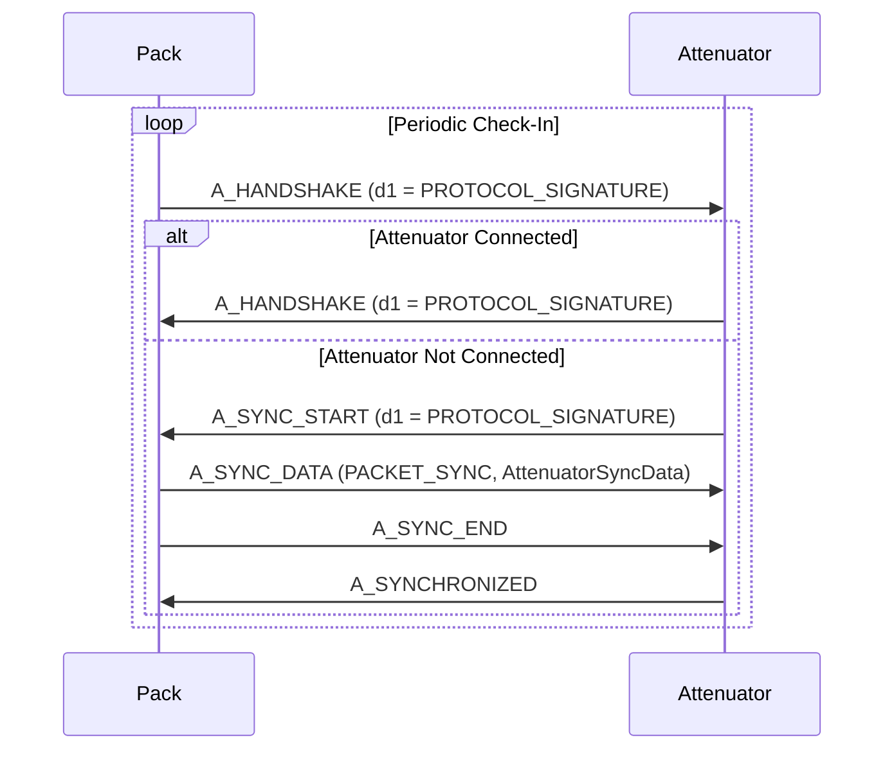
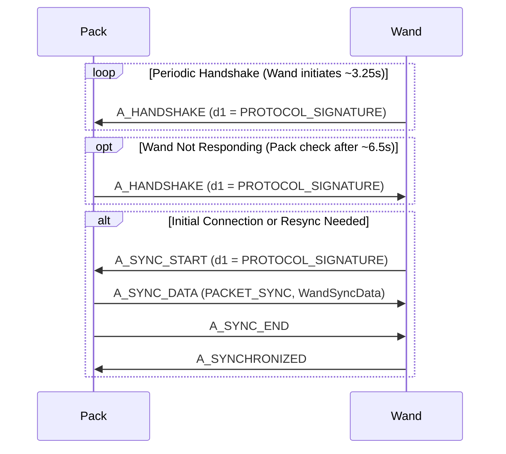
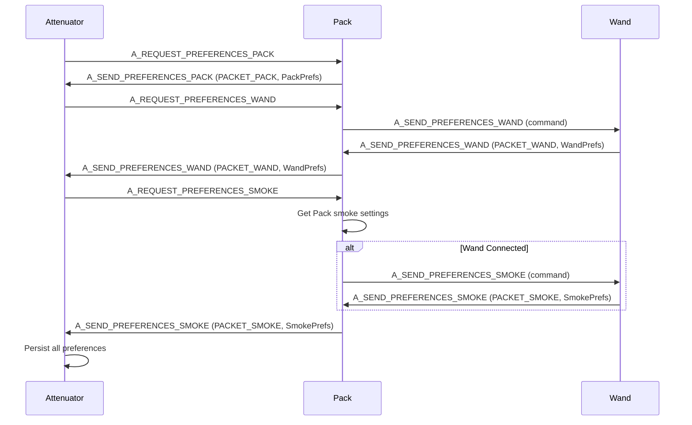
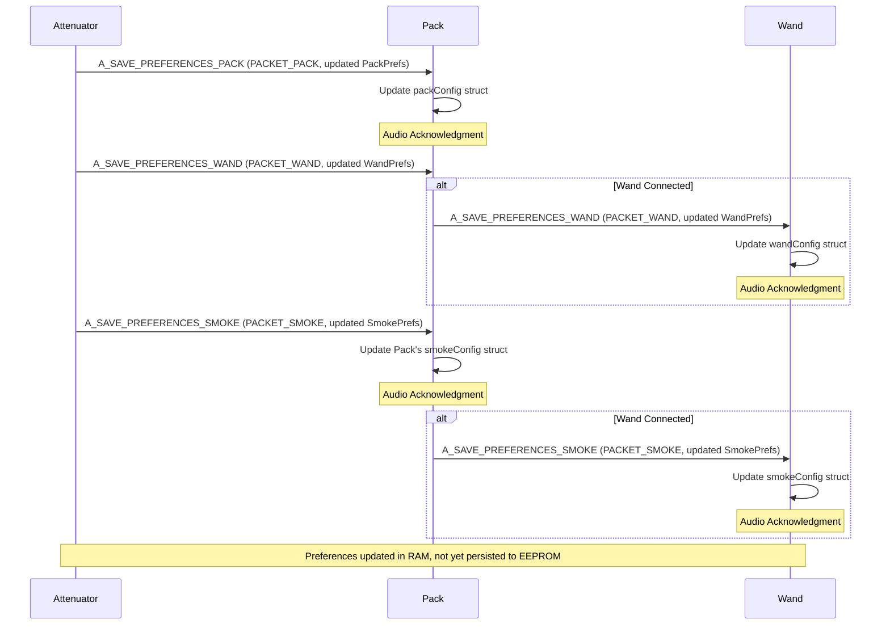
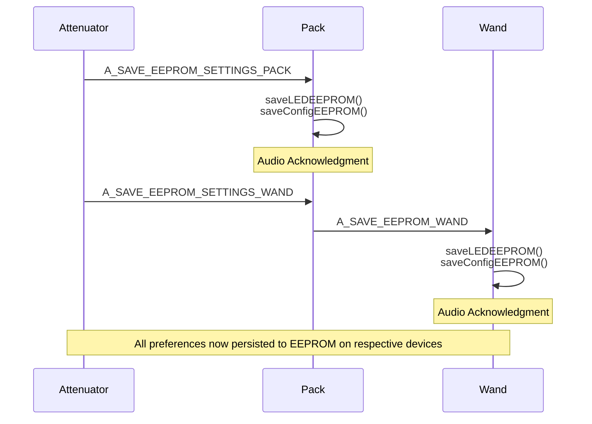

# Device API Sequences

Provides sequence diagrams for special interactions between devices.

## Handshake + Sync: Pack <-> Attenuator

---

## Handshake + Sync: Pack <-> Wand

---

## Preferences Exchange: Attenuator → Pack → Wand (Relay Pattern)

---

## Preferences Storage: Attenuator → Pack → Wand (Relay Pattern)

---

## EEPROM Persistence: Saving Preferences to Storage

