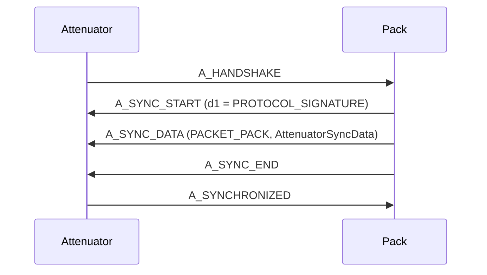
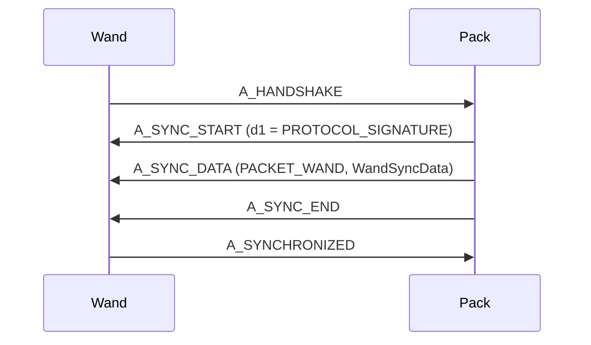
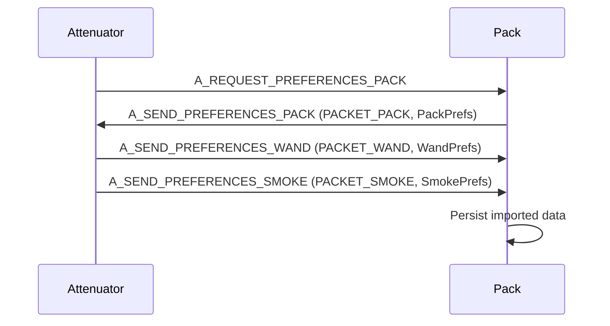
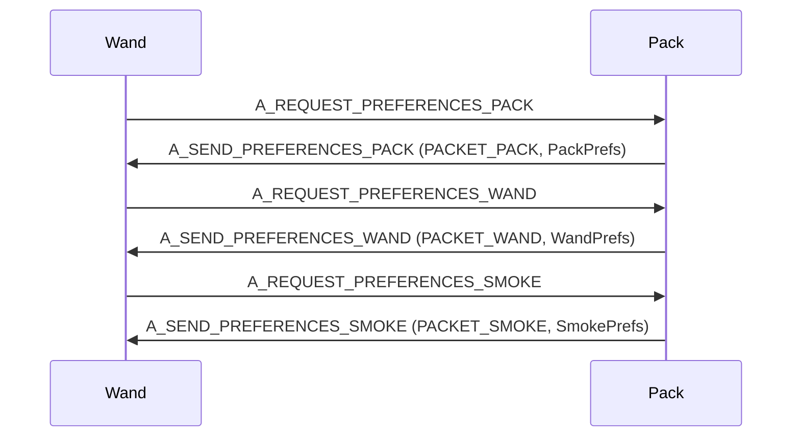
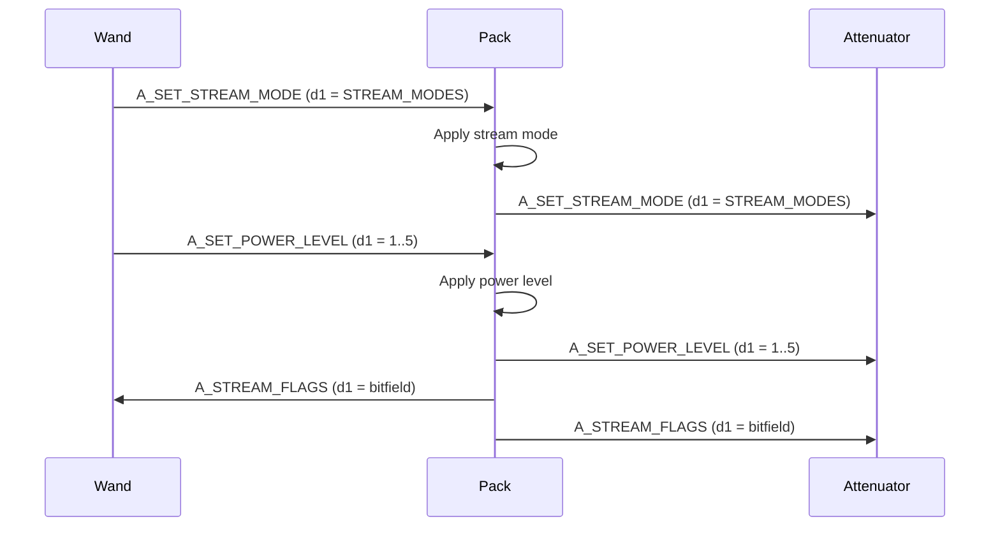
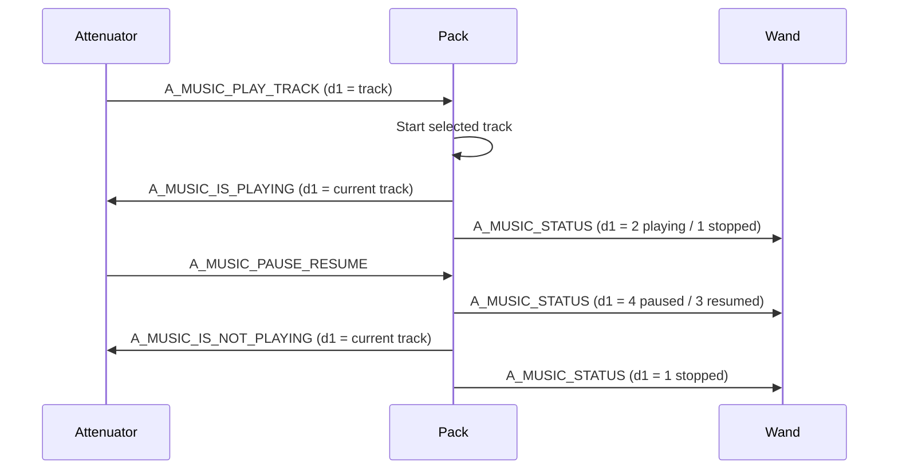
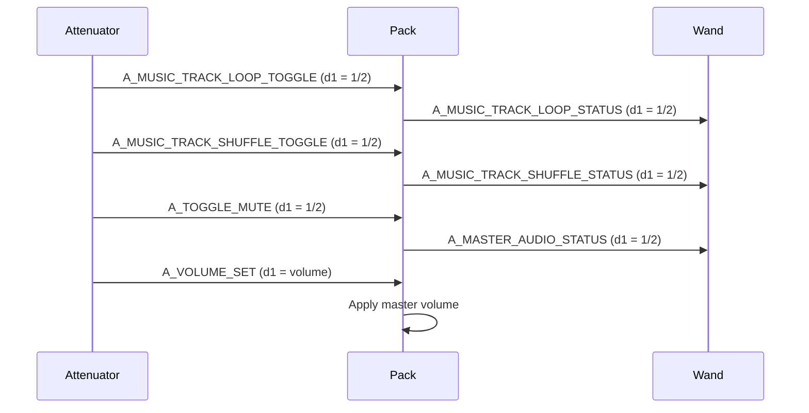
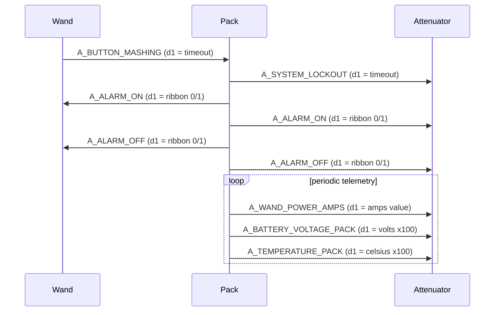

# Device API Sequences

Provides sequence diagrams for special interactions between devices.

## Handshake + Sync: Attenuator <-> Pack

---

## Handshake + Sync: Wand <-> Pack

---

## Preferences Exchange: Attenuator <-> Pack

---

## Preferences Exchange: Wand <-> Pack

---

## Stream Mode + Power Propagation

---

## Music Control + Playback Status Propagation

---

## Loop/Shuffle/Mute + Volume Control Propagation

---

## Alarm + Lockout + Telemetry Status Flows

